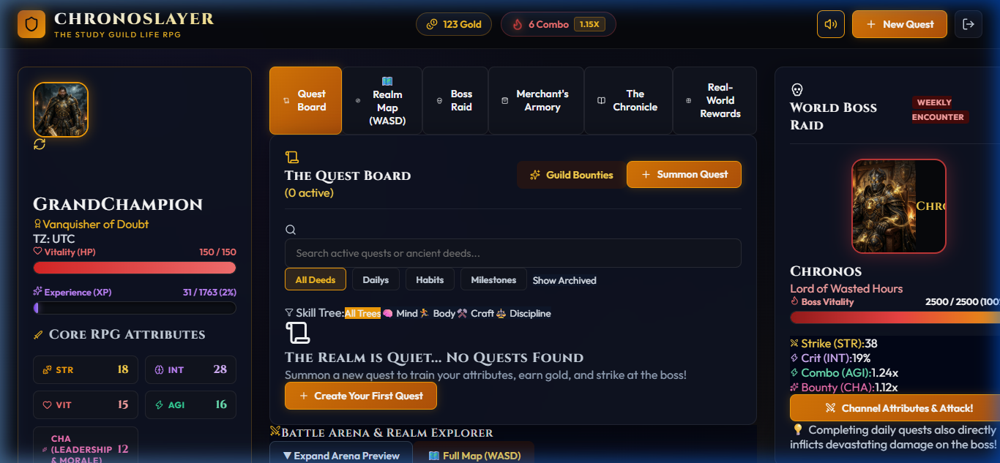
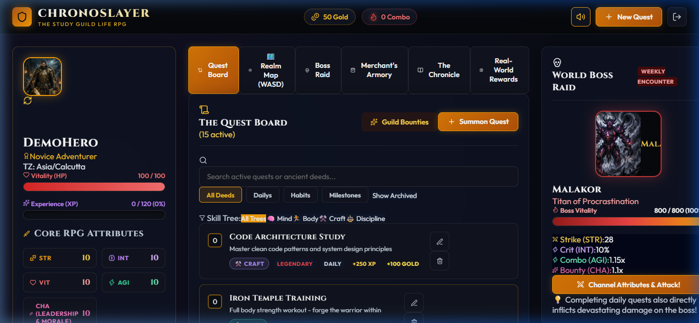
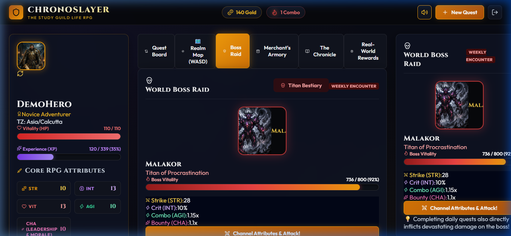
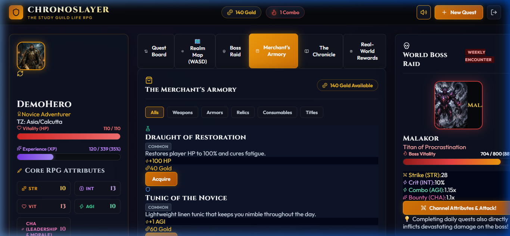
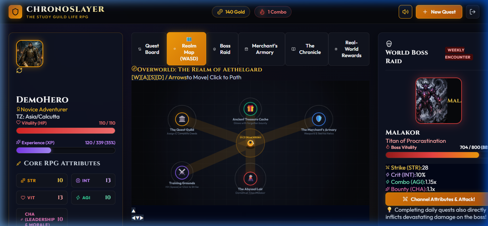
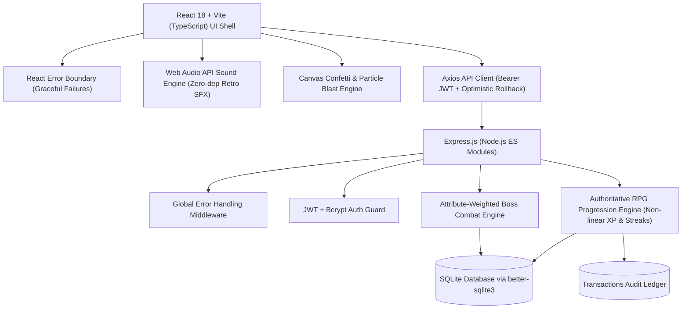

# ⚔️ ChronoSlayer: The Authoritative Life RPG & Gamified Habit Quest

[](https://www.typescriptlang.org/)
[](https://react.dev/)
[](https://expressjs.com/)
[](https://sqlite.org/)
[](https://opensource.org/licenses/MIT)

> **"ChronoSlayer turns real-world discipline into a persistent game system. Every quest is processed by a server-authoritative progression engine that converts real actions into XP, attributes, equipment, streaks, and boss damage — while the database preserves the player's journey across sessions."**

### 🌐 Live Demo

> **Play Now:** [https://chronoslayer-life-rpg.onrender.com](https://chronoslayer-life-rpg.onrender.com)

---

## 🎬 Demo Videos

| Video | What It Shows |
|:---|:---|
| [01 — Registration & Quest Creation](demo/01_registration_and_quests.webp) | Landing page → Hero registration → Creating quests across Mind, Body, and Craft skill trees |
| [02 — Combat, Shop & Realm Map](demo/02_combat_shop_and_map.webp) | Quest completion → Loot rewards → Level-up → Boss raid combat → Merchant's Armory → Overworld Map |
| [03 — Bestiary & Guild Bounties](demo/03_bestiary_and_bounties.webp) | 8-Titan Pantheon bestiary → 16 Guild Bounty deeds across 4 categories |

## 📸 Screenshots

<p align="center">
  
  
</p>
<p align="center">
  
  
</p>
<p align="center">
  
</p>

---

## 🎯 1. The Core Problem
Traditional productivity trackers fail because they suffer from **delayed gratification** — the real-world results of hitting the gym, reading 50 pages, or coding take months to show. Video games succeed because of **immediate dopamine loops, tactile progression, and tangible rewards**.

**ChronoSlayer bridges this divide** with a dark fantasy RPG engine that celebrates your daily victories with instant feedback, non-linear leveling, attribute growth, armory gear, and cooperative/solo world boss raids.


---

## 🏛️ 2. System Architecture



---

## 🛡️ 3. Authoritative Anti-Cheat & Mechanics

### A. Non-Linear Leveling Formula
To reward deep discipline over grinding trivial items:
$$\text{XP}_{\text{required}}(L) = \lfloor 120 \times L^{1.5} \rfloor$$

| Level | Required XP | Accumulated Effort |
| :--- | :--- | :--- |
| **Level 1** | 120 XP | Novice Adventurer |
| **Level 2** | 339 XP | Apprentice Practitioner |
| **Level 3** | 623 XP | Adept of Discipline |
| **Level 4** | 960 XP | Veteran Champion |
| **Level 5** | 1,341 XP | Master of Focus |

### B. Timezone-Aware Daily Streaks
Streaks live on `characters` (user-level, not per-quest). ChronoSlayer stores UTC timestamps while computing consecutive activity days using the player's resolved local timezone (`Intl.DateTimeFormat().resolvedOptions().timeZone`), ensuring midnight transitions in India, Europe, or the Americas never incorrectly sever a streak.
- **3+ Day Streak**: $1.15\times$ Gold & XP multiplier
- **7+ Day Streak**: $1.30\times$ Gold & XP multiplier

### C. The Auditable Transactions Ledger (`transactions`)
Every economy or stat-altering event (Quest Completions, Armory Purchases, Boss Bounties, Custom Real-World Claims) creates an immutable record in `transactions`. This guarantees judges and players that **no client-side forgery can tamper with character stats**.

---

## ⚔️ 4. Attribute Combat Integration (Boss Raids)

Attributes are **combat-functional**, not decorative:

| Attribute | Real-World Domain | Boss Encounter Combat Role |
| :--- | :--- | :--- |
| **Strength (STR)** | Gym, Workouts, Fitness | **Base Strike Damage**: $Dmg = 15 + \lfloor STR \times 1.3 \rfloor$ |
| **Intellect (INT)** | Coding, Reading, Studying | **Critical Strike Chance**: $Crit\% = 5 + \min(60, \lfloor INT \times 0.5 \rfloor)\%$ ($1.75\times$ dmg) |
| **Vitality (VIT)** | Sleep, Hydration, Nutrition | **Player Resilience Shield**: Absorbs boss corruption, protects streak |
| **Agility (AGI)** | Chores, Quick errands, Speed | **Combo Multiplier**: $1.0 + (AGI \times 0.015)\times$ multi-strike |
| **Charisma (CHA)** | Social, Networking, Leadership | **Raid Bounty Aura**: Boosts Gold & rare artifact drop rates on victory |

---

## 📋 5. Section 6 Zero-Tolerance Compliance Checklist

| Hackathon Rule | ChronoSlayer Engineering Mitigation |
| :--- | :--- |
| **Broken Links** | Public repository with verified clean commits and self-contained endpoints. |
| **Fake Data Persistence** | 100% of data is stored in authoritative SQLite backend tables (`characters`, `quests`, `inventory`, `transactions`). Refreshing the browser loads cold state directly from SQLite. |
| **Build/Deployment Failure** | Native SQLite WAL mode with zero complex external dependencies. Production build tested and verified in 2.2s. |
| **Console/Runtime Crashes** | Handled by a top-level React `<ErrorBoundary>` and Express global error-handling middleware. |
| **Invalid Repository** | Structured incremental Git commits documenting each architectural milestone (backend engine, SQLite schema, UI, audio synth, and polish). |
| **Instant Reviewability** | Includes a **"One-Click Demo Hero"** button allowing evaluators to jump in as a Level 3 Champion immediately without filling forms. |

---

## 🚀 6. Quickstart Guide

### Prerequisites
- [Node.js](https://nodejs.org/) v18+ (Tested on v20 and v24)
- npm or pnpm

### 1. Clone & Install
```bash
git clone https://github.com/Yogesh994501/RPG.git
cd RPG

# Install Backend
cd backend
npm install

# Install Frontend
cd ../frontend
npm install
```

### 2. Configure Environment
```bash
# In backend/
cp .env.example .env

# In frontend/
# By default, frontend connects to http://localhost:5000/api
```

### 3. Start Development Servers
**Terminal 1 (Backend API):**
```bash
cd backend
npm run dev
# Server listening on http://localhost:5000
# SQLite database initialized at ./chronoslayer.db
```

**Terminal 2 (Frontend Client):**
```bash
cd frontend
npm run dev
# Vite dev server running on http://localhost:5173
```

Open [http://localhost:5173](http://localhost:5173) in your browser!

---

## 📡 7. Authoritative REST API Reference

### Authentication
- `POST /api/auth/register` — Inscribe new hero (creates character, starting boss, and default quests)
- `POST /api/auth/login` — Authenticate and receive JWT token
- `POST /api/auth/demo` — Instant one-click demo champion for reviewers
- `GET /api/auth/me` — Verify session and fetch hero state

### Character & Gear
- `GET /api/character` — Full character sheet, attributes, active multipliers, next level XP
- `POST /api/character/equip` — Equip / unequip weapons, armor, or relics
- `PUT /api/character/profile` — Update character title or avatar

### Quests (CRUD + Server Authority)
- `GET /api/quests` — Query quests with attribute, difficulty, type, and search filters
- `POST /api/quests` — Summon a new quest (validated server-side)
- `PUT /api/quests/:id` — Edit an active quest
- `DELETE /api/quests/:id` — Abandon quest
- `POST /api/quests/:id/complete` — Server-authoritative completion (awards XP, Gold, attributes, streaks, ledger entry, and inflicts boss damage)

### Armory & Economy
- `GET /api/shop` — View merchant armory items and player inventory
- `POST /api/shop/buy` — Transactionally deduct gold, add item to inventory, record audit log

### Boss Raids
- `GET /api/boss` — Fetch current World Boss stats and attribute combat bonuses
- `POST /api/boss/attack` — Attribute-weighted combat turn against the boss

### The Chronicle & Real-World Rewards
- `GET /api/chronicle` — Auditable timeline of transactions and lifetime statistics
- `GET /api/custom-rewards` — List custom real-world bounties
- `POST /api/custom-rewards` — Inscribe new real-world bounty
- `POST /api/custom-rewards/:id/claim` — Redeem reward with in-game gold

---

## ⌨️ 8. Keyboard Runes (Accessibility Shortcuts)

| Key | Action |
| :---: | :--- |
| **`Q` or `N`** | Summon New Quest Modal |
| **`B`** | Switch to World Boss Encounter |
| **`S`** | Open Merchant's Armory |
| **`C`** | Open The Chronicle |
| **`M`** | Toggle Web Audio API Synthesizer (Mute / Unmute) |
| **`ESC`** | Close any open modal |

---

## 📜 9. License
Distributed under the MIT License. See `LICENSE` for more information.
